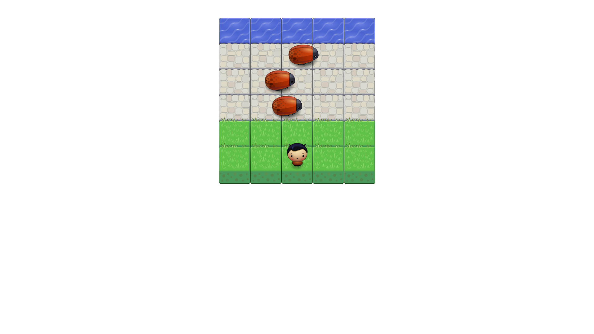

Classic Arcade Game Clone
===============================

  

# About
This is my Classic Arcade Game Clone project for Udacity Frontend Nanodegree program. The project should recreate a classic arcade game mostly known as [Froger](https://en.wikipedia.org/wiki/Frogger).

## How To Run The Game

- Download or clone the repository;
- If you downloaded the project, unzip the file;
- In the folder of the project you will find `index.html` file.
- Open the `index.html` in your favorite browser.

### Game Rules

In this game you have a Player and Enemies (Bugs). The goal of the player is to reach the water, without colliding into any one of the enemies. The player can move left, right, up and down. The enemies move in varying speeds on the paved block portion of the scene. Once a the player collides with an enemy, the game is reset and the player moves back to the start square. Once the player reaches the water the game is won.

### License
The content of this repository is licensed under a [Creative Commons Attribution License](https://choosealicense.com/licenses/mit/).
